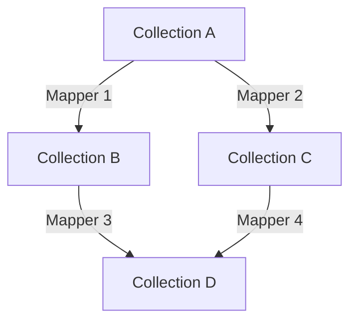
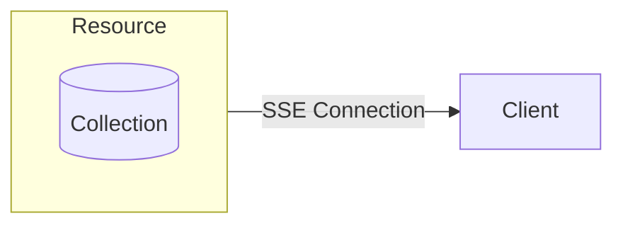
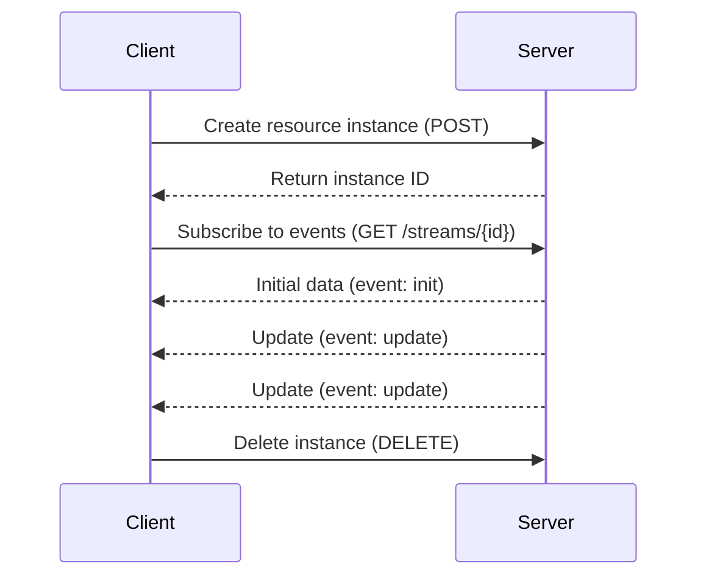
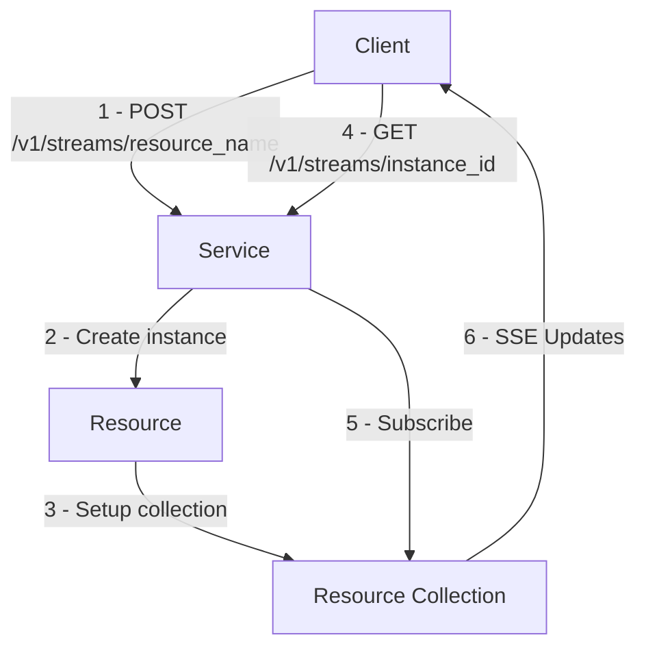
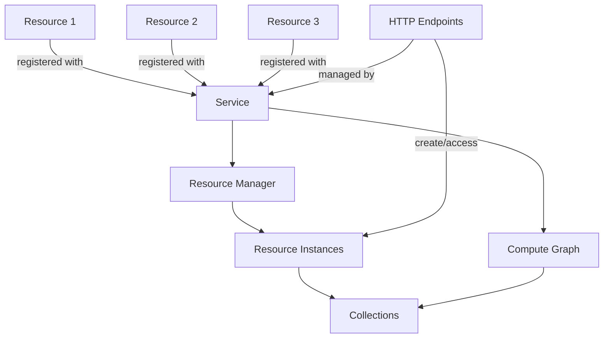

# Introduction to the Reactive Framework

The Reactive Backend Framework is a Python-based system for building reactive applications where data and computation outputs can be efficiently streamed to clients in real-time. This framework leverages reactive programming principles to create responsive, data-driven applications with minimal boilerplate code.

:::tip
The source code is available [here on github](https://github.com/CFSY/meta-reactive).
:::

## Motivation
Following the initial exploration of metaprogramming techniques in the first half of the project, the next logical step was to apply the concepts in a more complex environment. To this end, the "Reactive Framework" was developed during the second half of the project. This framework serves a dual purpose:

1.  **Embodying Core Concepts for Future Work:** While not a full-fledged stream processing engine, the reactive framework intentionally incorporates core concepts relevant to such systems. Features like `Collections` representing data sources, `Mappers` defining transformation pipelines, a `ComputeGraph` managing dependencies and propagation of changes, and `Resources` exposing data streams via Server-Sent Events (SSE) provide a tangible link to the broader goal of building distributed streaming applications. It acts as a practical testbed for API design philosophies applicable to more complex streaming scenarios.

2.  **Providing a Platform for Metaprogramming Comparison:** The primary motivation was to create a concrete example demonstrating the practical benefits and tradeoffs of applying metaprogramming to API design. To achieve this, the framework was intentionally designed with **two distinct APIs** offering identical core functionality:
    -   A **Classic API**, adhering to traditional Python object-oriented principles.
    -   A **Metaprogramming API**, leveraging decorators and other metaprogramming techniques for a more concise and declarative developer experience.

  This dual-API approach allows for a direct, side-by-side comparison, highlighting how metaprogramming can simplify complex interactions and reduce boilerplate.

## Core Concepts

The framework is built around several key concepts that work together to create an efficient reactive computation engine:

### Reactive Programming

Reactive programming is a declarative programming paradigm focused on data flows and propagation of changes. In this paradigm, when source data changes, the changes automatically propagate to dependent computations and outputs.

Our framework implements this paradigm by:
1. Building a dependency graph of data and computations
2. Efficiently propagating changes through this graph
3. Streaming updates to clients via Server-Sent Events (SSE)

### Collections

Collections are the core data structures over which reactive computations operate. They serve as the vertices of the reactive computation graph.

### Mappers

Mappers define transformations between collections. They form the edges of the reactive computation graph, specifying how data is transformed from one collection to another.

There are two primary types of mappers:
1. **OneToOneMapper**: Transforms each value in a collection to a new value, preserving the key
2. **ManyToOneMapper**: Aggregates multiple values with the same key into a single value

### Compute Graph

The compute graph manages the dependencies between collections and ensures that changes propagate efficiently through the system.

The compute graph:
- Tracks dependencies between collections
- Invalidates affected collections when source data changes
- Performs recomputation in an efficient topological order
- Prevents circular dependencies and redundant computations

### Resources

Resources expose collections to external clients, providing a way to create, access, and subscribe to reactive data sources.

Key features of resources:
- Resources are parameterized by a Pydantic model
- Each resource instantiation creates a configured collection
- Resources can be streamed to clients via Server-Sent Events
- Multiple clients can subscribe to the same resource instance

### Server-Sent Events (SSE)

The framework uses Server-Sent Events to stream reactive updates to clients. 
Clients first perform a POST request to the resource endpoint to instantiate a resource, the server will respond with an instance ID.
The client can then begin streaming data through SSE using the instance ID.

### Access Flow

Here's a diagram showing how clients access resources through the service:

### Overall Architecture

Here's a diagram showing the architecture of the service:

## API Implementations

The framework provides two API implementations with identical functionality but different programming styles:

### Classic API

The Classic API follows traditional object-oriented patterns with explicit class inheritance and method implementations. It provides a familiar interface for developers used to working with standard Python libraries.

### Metaprogramming API

The Metaprogramming API leverages Python's advanced features like decorators, metaclasses, and AST analysis to provide a more concise and declarative interface. This API reduces boilerplate code and makes applications more readable while maintaining the same functionality.

