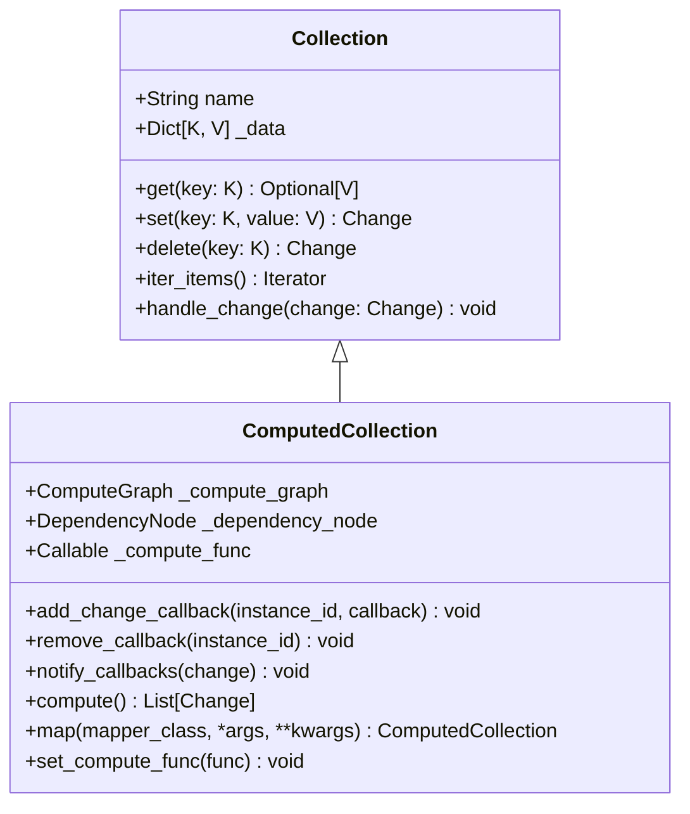

# Collections

Collections are the fundamental data structures in the Reactive Framework. They store data as key-value pairs and form the vertices of the reactive computation graph.

## Types of Collections

The framework contains two main types of collections:

1. **Base Collection** - The core data structure without reactive capabilities
2. **Computed Collection** - Extended with reactive computation capabilities

:::info

Users should not have a need to use the base `Collection` directly. Instead, they should use the `ComputedCollection`, which are the primary way to interact with the framework.

:::




## Creating Collections

### Base Collection

```python
from reactive.core.collection import Collection

# Create a collection of string keys and integer values
collection = Collection[str, int]("my_collection")
```

### Computed Collection

```python
from reactive.core.compute_graph import ComputeGraph, ComputedCollection

# Create a compute graph
compute_graph = ComputeGraph()

# Create a computed collection
collection = ComputedCollection[str, int]("my_computed_collection", compute_graph)
```

## Working with Collections

### Setting Values

```python
# Set a value
collection.set("key1", 42)
collection.set("key2", 100)
collection.set("key3", 200)
```

### Getting Values

```python
# Get a single value
value = collection.get("key1")  # Returns 42 or None if key doesn't exist

# Get all values as a dictionary
all_data = collection.get_all()  # Returns {'key1': 42, 'key2': 100, 'key3': 200}
```

### Deleting Values

```python
# Delete a value
collection.delete("key1")
```

### Iterating Over Items

```python
# Iterate over all key-value pairs
for key, value in collection.iter_items():
    print(f"{key}: {value}")
```

## Computed Collections

Computed collections extend the base collection with reactive capabilities:

### Responding to Changes

When a computed collection is created, it registers itself with the compute graph:

```python
# This collection will participate in reactive computations
computed_collection = ComputedCollection[str, int]("my_collection", compute_graph)
```


### Using Mappers

You can define computations through mappers:

```python
from reactive.classic.mapper import OneToOneMapper

class DoubleValueMapper(OneToOneMapper):
    def map_value(self, value):
        return value * 2

# Create a derived collection
doubled_collection = source_collection.map(DoubleValueMapper)
```

In the next section, we'll explore mappers in more detail.