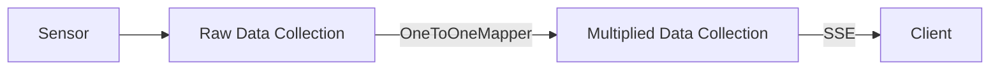

# Getting Started

The Classic API provides a traditional, object-oriented approach to creating reactive applications. This guide will walk you through the basics of using the Classic API.

## Basic Concepts

The Classic API is built around several key classes:

- `ComputedCollection` - Collection data structure with reactive capabilities
- `Mapper` (with variants like `OneToOneMapper` and `ManyToOneMapper`) - Define transformations
- `Resource` - Expose collections to clients
- `Service` - Host and serve resources

## Creating a Simple Application

:::tip

You can run this example locally. It is available under the [`examples/basic`](https://github.com/CFSY/meta-reactive/tree/main/examples/basic) directory.

:::



Let's create a simple application. In this example, we have a simulated sensor that generates a value every second.
The sensor value is kept in the `raw_data` collection.

We then define a mapper `MultiValueMapper` that multiplies the sensor value by a multiple and returns a formatted message.

Lastly we define a resource `DataProcessorResource` that allows a client to stream data from a sensor. Additionally, the client can specify a multiplier parameter to modify the mapped sensor value.

```python
import asyncio
import time

from pydantic import BaseModel
from reactive.classic.mapper import OneToOneMapper
from reactive.classic.resource import Resource, ResourceParams
from reactive.classic.service import Service
from reactive.core.compute_graph import ComputedCollection


# Define data models
class DataPoint(BaseModel):
    value: float
    timestamp: str


# Define a mapper
class MultiValueMapper(OneToOneMapper):
    def __init__(self, multiplier: float):
        self.multiplier = multiplier

    def map_value(self, value):
        if value is None:
            return None
        return {"value": value.value * self.multiplier, "timestamp": value.timestamp}


# Define resource parameters
class ProcessorParams(ResourceParams):
    multiplier: float


# Define a resource
class DataProcessorResource(Resource):
    def __init__(self, data_collection, compute_graph):
        super().__init__(ProcessorParams, compute_graph)
        self.data = data_collection

    def setup_resource_collection(self, params):
        # Create a derived collection by mapping the input data
        multiplied_data = self.data.map(MultiValueMapper, params.multiplier)
        return multiplied_data


async def main():
    # Create a service
    service = Service("data_processor", port=8080)

    # Create a collection for raw data
    raw_data = ComputedCollection("raw_data", service.compute_graph)

    # Create and register our resource
    processor = DataProcessorResource(raw_data, service.compute_graph)
    service.add_resource("processor", processor)

    async def generate_data():
        val = 1
        while True:
            val += 1
            timestamp = time.strftime("%H:%M:%S", time.localtime())
            raw_data.set(
                "sensor1",
                DataPoint(value=val, timestamp=timestamp),
            )
            print(f"sensor1 value: {val} time: {timestamp}")
            await asyncio.sleep(1)

    service_task = asyncio.create_task(service.start())
    simulation_task = asyncio.create_task(generate_data())
    await asyncio.gather(service_task, simulation_task)


if __name__ == "__main__":
    asyncio.run(main())
```

## Connecting a Client

You can connect to this service using an HTTP client that supports Server-Sent Events.

First, we instantiate a resource with the parameters `{"multiplier": 3.0}`.

We then connect to the stream with the provided instance ID.

```python
import asyncio
import json

import aiohttp


async def run_client():
    async with aiohttp.ClientSession() as session:
        # Create stream
        async with session.post(
            "http://localhost:8080/v1/streams/processor", json={"multiplier": 3.0}
        ) as response:
            stream_data = await response.json()
            stream_id = stream_data["instance_id"]
            print(f"Stream created with ID: {stream_id}")

        # Connect to stream
        async with session.get(
            f"http://localhost:8080/v1/streams/{stream_id}",
            headers={
                "Accept": "text/event-stream",
                "Cache-Control": "no-cache",
                "Connection": "keep-alive",
            },
        ) as response:
            async for line in response.content:
                if line.startswith(b"data: "):
                    data = json.loads(line[6:].decode("utf-8"))
                    print(f"Received: {data}")


if __name__ == "__main__":
    asyncio.run(run_client())
```

This is just a basic example. In the next sections, we'll explore each component in more detail and cover more advanced usage patterns.
