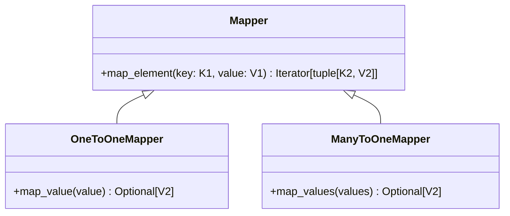

# Mappers

Mappers are a key component in the Reactive Framework that define transformations between collections. They form the edges of the reactive computation graph, specifying how data is transformed from source collections to target collections.

## Types of Mappers

The framework provides two main types of mappers:



1. **OneToOneMapper** - Transforms individual values, preserving keys
2. **ManyToOneMapper** - Aggregates multiple values into a single result
:::note
The other mapper types were not implemented for simplicity
:::

## Creating Mappers

Mappers are implemented by subclassing one of the mapper types and implementing the appropriate mapping method.

### OneToOneMapper

```python
from reactive.classic.mapper import OneToOneMapper
from typing import Optional

class DoubleValueMapper(OneToOneMapper[str, int, str, int]):
    def map_value(self, value: int) -> Optional[int]:
        return value * 2
```

### ManyToOneMapper

```python
from reactive.classic.mapper import ManyToOneMapper
from typing import List, Optional

class AverageMapper(ManyToOneMapper[str, float, str, float]):
    def map_values(self, values: List[float]) -> Optional[float]:
        if not values:
            return None
        return sum(values) / len(values)
```

## Mapper Parameters

Mappers can take additional parameters in their constructor to customize their behavior or reference other collections:

```python
from reactive.classic.mapper import OneToOneMapper
from reactive.core.compute_graph import ComputedCollection

class EnrichmentMapper(OneToOneMapper[str, dict, str, dict]):
    def __init__(self, reference_collection: ComputedCollection):
        self.reference = reference_collection
        
    def map_value(self, value: dict) -> dict:
        # Enrich value with data from reference collection
        key = value.get('id')
        ref_data = self.reference.get(key)
        if ref_data:
            # Create a new dict to avoid modifying the original
            enriched = dict(value)
            enriched['reference_data'] = ref_data
            return enriched
        return value
```

## Using Mappers with Collections

Mappers are applied to collections using the `map` method, which creates a new computed collection:

```python
# Create source collection
temperatures = ComputedCollection[str, float]("temperatures", compute_graph)

# Apply a mapper to create a derived collection
class CelsiusToFahrenheitMapper(OneToOneMapper[str, float, str, float]):
    def map_value(self, celsius: float) -> float:
        return (celsius * 9/5) + 32

fahrenheit_temps = temperatures.map(CelsiusToFahrenheitMapper)
```

You can also pass parameters to mappers:

```python
class ScaledMapper(OneToOneMapper[str, float, str, float]):
    def __init__(self, scale_factor: float):
        self.scale_factor = scale_factor
        
    def map_value(self, value: float) -> float:
        return value * self.scale_factor

# Create a collection with values scaled by 2.5
scaled_temps = temperatures.map(ScaledMapper, 2.5)
```

:::info

Mapper parameters must be explicitly added to the mapper through the constructor.
This is necessary for the framework's reactivity. 
Internally, the framework checks a mapper's constructor arguments for reactive components and adds them to the compute graph for dependency tracking.

:::

Here is an example combing two collections:


```python
class CombiningMapper(OneToOneMapper[str, dict, str, dict]):
    def __init__(self, secondary_collection):
        self.secondary = secondary_collection
        
    def map_value(self, primary_value):
        # Get corresponding value from secondary collection
        secondary_value = self.secondary.get(self.key)
        if secondary_value is None:
            return primary_value
            
        # Combine the values
        result = dict(primary_value)
        result.update({
            'combined': True,
            'secondary_data': secondary_value
        })
        return result

# Create combined collection
combined = primary_collection.map(CombiningMapper, secondary_collection)
```

In the next section, we'll explore how to expose these reactive collections as resources that can be accessed by clients.