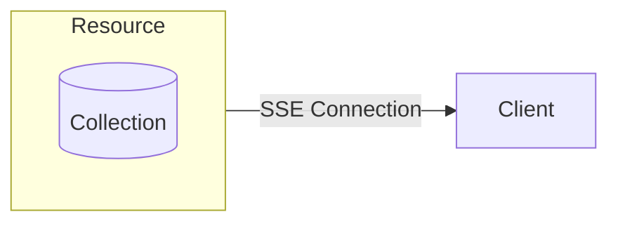
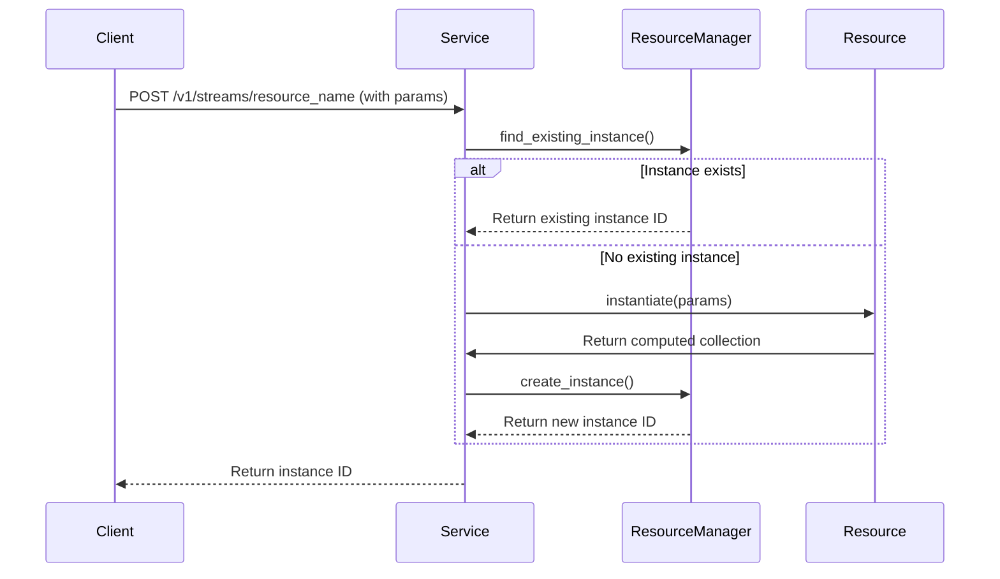
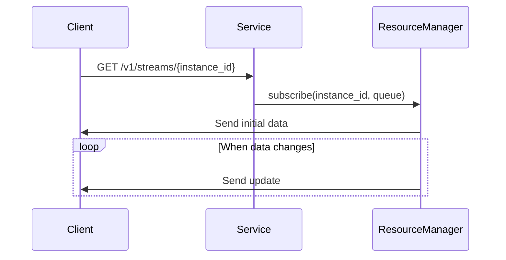

# Resources

Resources are the interface between your application's reactive data and external clients. They expose collections through HTTP endpoints and allow clients to subscribe to data changes via Server-Sent Events (SSE).



## Creating Resources

### 1. Define Parameter Model

Resources can accept parameters that helps you customize its behavior. To start, define a Pydantic model for your resource parameters:

```python
from pydantic import BaseModel
from reactive.classic.resource import ResourceParams

# Define resource parameters
class ProcessorParams(ResourceParams):
    multiplier: float
```

### 2. Implement Resource Class

Then, create a resource class that sets up the reactive collection:

```python
from reactive.classic.resource import Resource
from reactive.core.compute_graph import ComputedCollection

# Define a resource
class DataProcessorResource(Resource):
    def __init__(self, data_collection, compute_graph):
        super().__init__(ProcessorParams, compute_graph)
        self.data = data_collection

    def setup_resource_collection(self, params):
        # Create a derived collection by mapping the input data
        multiplied_data = self.data.map(MultiValueMapper, params.multiplier)
        return multiplied_data
```

## Registering Resources with a Service

Register your resource with a service to make it available to clients:

```python
from reactive.classic.service import Service
from reactive.core.compute_graph import ComputedCollection

# Create a service
service = Service("data_processor", port=1234)

# Create a collection for raw data
raw_data = ComputedCollection("raw_data", service.compute_graph)

# Create and register our resource
processor = DataProcessorResource(raw_data, service.compute_graph)
service.add_resource("processor", processor)
```

## Accessing a resource

There are two main steps for a client to access a resource:
1. Instantiate a resource using a POST request
2. Stream data from the resource through a SSE GET request

### Resource Instantiation

To instantiate a resource, make a POST request to the following endpoint `/v1/streams/{resource_name}`. `resource_name` is the name provided during registration, in our example it is `"processor"`. Additionally, provide the parameters as a JSON body.

```python
async with aiohttp.ClientSession() as session:
    # Create stream
    async with session.post(
        "http://localhost:1234/v1/streams/processor", json={"multiplier": 3.0}
    ) as response:
        stream_data = await response.json()
        stream_id = stream_data["instance_id"]
        print(f"Stream created with ID: {stream_id}")
```


When a client requests a resource, the framework:

1. Validates the parameters
2. Checks if an instance with these parameters already exists
3. Creates a new instance if needed, else it finds a shared instance with the same parameters
4. Returns an instance ID to the client



## Subscribing to Resources

Clients can then subscribe to resources using Server-Sent Events by calling the `/v1/streams/{instance_id}` endpoint with the provided instance ID.

```python
async with aiohttp.ClientSession() as session:
    # Connect to stream
    async with session.get(
        f"http://localhost:1234/v1/streams/{stream_id}",
        headers={
            "Accept": "text/event-stream",
            "Cache-Control": "no-cache",
            "Connection": "keep-alive",
        },
    ) as response:
        async for line in response.content:
            if line.startswith(b"data: "):
                data = json.loads(line[6:].decode("utf-8"))
                print(f"Received: {data}")
```



## Resource Parameters

Resources are parameterized using Pydantic models, which provides:

1. **Type validation** - Parameters are validated against their expected types
2. **Default values** - Parameters can have default values
3. **Required fields** - Parameters can be required or optional

```python
class DashboardParams(ResourceParams):
    # Required parameter
    user_id: str
    
    # Optional parameter with default
    refresh_rate: int = 30
    
    # Optional parameter with validation
    filter_threshold: Optional[float] = Field(None, ge=0, le=100)
```

In the next section, we'll explore how to configure and run services that host these resources.