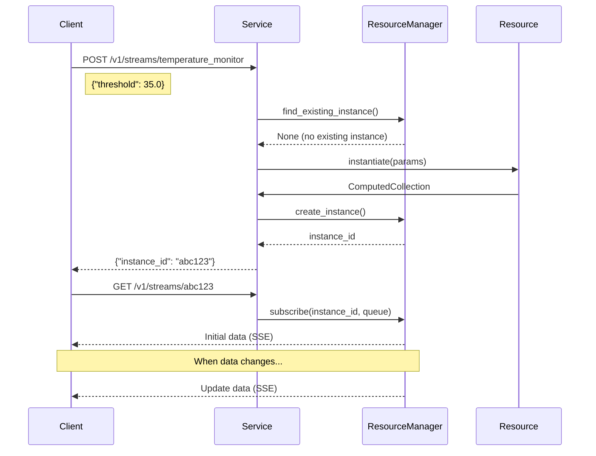

# Service

The Service class is responsible for hosting resources and exposing them to clients through HTTP endpoints. It sets up a web server, manages resource instances, and handles client connections.


## Creating a Service

```python
from reactive.classic.service import Service

# Create a service that listens on localhost:1234
service = Service("my_service", host="localhost", port=1234)
```

## Adding Resources

Resources must be registered with the service to be accessible to clients:

```python
from reactive.classic.resource import Resource
from reactive.core.compute_graph import ComputedCollection

# Create collections
users_collection = ComputedCollection[str, dict]("users", service.compute_graph)
activities_collection = ComputedCollection[str, list]("activities", service.compute_graph)

# Create resources
user_resource = UserResource(users_collection, service.compute_graph)
activity_resource = ActivityResource(activities_collection, service.compute_graph)

# Register resources with the service
service.add_resource("users", user_resource)
service.add_resource("activities", activity_resource)
```

## HTTP Endpoints

The service exposes the following HTTP endpoints:

1. **Create Stream**: `POST /v1/streams/<resource_name>`
   - Creates a new resource instance with specified parameters
   - Returns an instance ID

2. **Subscribe to Stream**: `GET /v1/streams/<instance_id>`
   - Establishes a Server-Sent Events connection to receive updates
   - Returns initial data and subsequent updates




## Server-Sent Events Format

The server sends updates using the Server-Sent Events format:

```
event: init
data: [[key1, value1], [key2, value2], ...]

event: update
data: [[key1, [new_value1]], [key2, [new_value2]], ...]
```

## Running the Service

The service is run asynchronously:

```python
import asyncio
from reactive.classic.service import Service

async def main():
    # Create service
    service = Service("my_service", port=1234)
    
    # Add resources
    # ...
    
    # Start the service
    await service.start()

if __name__ == "__main__":
    asyncio.run(main())
```