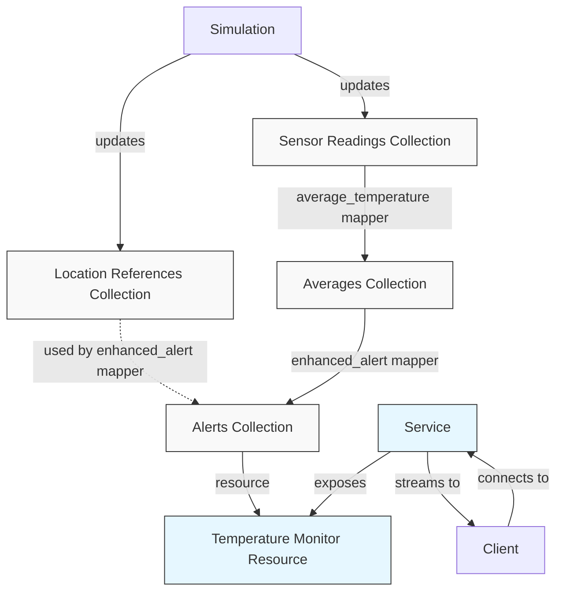

# API Comparison: Classic vs Metaprogramming

The reactive framework provides two API styles that offer the same functionality but with different syntax and levels of abstraction. Let's compare them using the temperature monitor example.

:::tip

You can run this example locally. It is available under the [`examples/temp_monitor`](https://github.com/CFSY/meta-reactive) directory.

:::

## Temperature Monitor Example

### Problem Description

The Temperature Monitor system collects readings from multiple temperature sensors placed in different locations (office, server room, warehouse). The system needs to:

1. Compute average temperatures for each sensor
2. Compare temperatures against acceptable ranges for each location
3. Generate alerts when temperatures exceed thresholds
4. Stream alerts to clients in real-time

### Architecture Diagram

Here's a diagram showing the architecture of the Temperature Monitor application:



1. **Sensor Readings Collection**: Contains lists of temperature readings for each sensor.
2. **Average Temperature Mapper**: Computes the average temperature for each sensor from its readings.
3. **Enhanced Alert Mapper**: Generates alerts by comparing temperatures against reference data.
4. **Location References Collection**: Contains acceptable temperature ranges for each location.
5. **Alerts Collection**: Contains generated alerts for each sensor.
6. **Temperature Monitor Resource**: Exposes the alerts to clients via the service.

### Classic VS Metaprogramming API

1. **Mappers**:
    - Classic
    ```python
    # Define mappers
    class AverageTemperatureMapper(ManyToOneMapper[str, SensorReading, Tuple[float, str]]):
        """Computes average temperature for each sensor from its readings"""

        def map_values(self, readings: list[SensorReading]) -> Tuple[float, str]:
            if not readings:
                return 0.0, ""
            avg_temp = sum(r.temperature for r in readings) / len(readings)
            # Return both temperature and location
            return avg_temp, readings[0].location


    class EnhancedAlertMapper(OneToOneMapper[str, Tuple[float, str], Dict[str, str]]):
        """
        Generates enhanced alerts by comparing current temperatures
        with reference data for each location
        """

        def __init__(
            self, location_references: ComputedCollection, global_threshold: float
        ):
            self.location_references = location_references
            self.global_threshold = global_threshold

        def map_value(self, value: Tuple[float, str]) -> Dict[str, str]:
            avg_temp, location = value

            # Get reference data for this location
            location_info = self.location_references.get(location)

            # Use common evaluation logic
            return evaluate_temperature_alert(
                avg_temp, location, location_info, self.global_threshold
            )
    ```

    - Metaprogramming
    ```python
    # Define mappers using decorators
    @many_to_one
    def average_temperature(readings: List[SensorReading]) -> Tuple[float, str]:
        """Computes average temperature for each sensor from its readings"""

        if not readings:
            return 0.0, ""
        avg_temp = sum(r.temperature for r in readings) / len(readings)
        # Return both temperature and location
        return avg_temp, readings[0].location


    @one_to_one
    def enhanced_alert(value: Tuple[float, str], global_threshold: float) -> Dict[str, str]:
        """
        Generates enhanced alerts by comparing current temperatures
        with reference data for each location
        """
        avg_temp, location = value

        # Get reference data for this location
        location_info = location_ref_collection.get(location)

        # Use common evaluation logic
        return evaluate_temperature_alert(
            avg_temp, location, location_info, global_threshold
        )
    ```

2. **Resource Definition with Parameters**:
    - Classic
    ```python
    # Define resource
    class MonitorParams(ResourceParams):
        threshold: float  # Global alert threshold in Celsius


    # Resource Implementation
    class TemperatureMonitorResource(Resource[str, dict]):
        def __init__(self, readings_collection, location_ref_collection, compute_graph):
            super().__init__(MonitorParams, compute_graph)
            self.readings = readings_collection
            self.location_references = location_ref_collection

        def setup_resource_collection(self, params: MonitorParams):
            # Compute average temperatures
            averages = self.readings.map(AverageTemperatureMapper)

            # Generate enhanced alerts using both averages and location references
            alerts = averages.map(
                EnhancedAlertMapper,
                self.location_references,  # Pass the location references collection
                params.threshold,  # Pass the global threshold
            )

            return alerts
    ```

    - Metaprogramming
    ```python
    # Define resource using decorator
    @resource
    def temperature_monitor(threshold: float):
        # Compute average temperatures
        averages = map_collection(readings_collection, average_temperature)

        # Generate enhanced alerts using both averages and location references
        alerts = map_collection(averages, enhanced_alert, threshold)

        return alerts
    ```

3. **Resource Registration**:
    - Classic
    ```python
    # Create and add resource
    temperature_monitor = TemperatureMonitorResource(
        readings_collection, location_ref_collection, service.compute_graph
    )
    service.add_resource("temperature_monitor", temperature_monitor)
    ```
    - Metaprogramming
    ```python
    # Nothing needed
    ```

### Key Differences

1. **Class vs. Function Approach**:
   - Classic API: Uses classes for mappers and resources
   - Metaprogramming API: Uses decorated functions

2. **Boilerplate Code**:
   - Classic API: Requires more boilerplate (class definitions, constructors, etc.)
   - Metaprogramming API: Minimal boilerplate, focusing on the core logic

3. **Resource Registration**:
   - Classic API: Explicit resource registration with `service.add_resource()`
   - Metaprogramming API: Automatic registration of resources decorated with `@resource`

4. **Dependency Management**:
   - Classic API: Dependencies must be explicitly passed in constructors
   - Metaprogramming API: Dependencies are automatically detected

5. **Code Length**:
   - Classic API: Typically more verbose
   - Metaprogramming API: More concise, already about 20% less code in this simple example.

The metaprogramming API delivers the same functionality as the classic API but in a more developer-friendly package that can significantly speed up development.