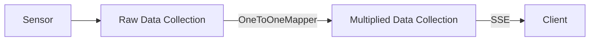

# Getting Started

The Metaprogramming API provides a more concise and declarative approach to creating reactive applications using Python's metaprogramming features. This guide will walk you through the basics of using the Metaprogramming API.


## Basic Concepts

The Metaprogramming API leverages Python's decorators, metaclasses, and AST analysis to provide a more streamlined interface to the reactive framework. It offers the same functionality as the Classic API but with less boilerplate code.

Key components include:

- Decorator-based mappers (`@one_to_one`, `@many_to_one`)
- Decorator-based resource definition with `@resource` decorator
- Simplified service configuration
- Automatic dependency detection

## Creating a Simple Application

:::tip

You can run this example locally. It is available under the [`examples/basic`](https://github.com/CFSY/meta-reactive) directory.

:::



Let's create a simple application. In this example, we have a simulated sensor that generates a value every second.
The sensor value is kept in the `raw_data` collection. 

We then define a mapper `MultiValueMapper` that multiplies the sensor value by a multiple and returns a formatted message.

Lastly we define a resource `DataProcessorResource` that allows a client to stream data from a sensor. Additionally, the client can specify a multiplier parameter to modify the mapped sensor value.

```python
import asyncio
import time

from pydantic import BaseModel
from reactive.core.compute_graph import ComputedCollection
from reactive.meta import one_to_one, resource, Service, map_collection


# Define data models
class DataPoint(BaseModel):
    value: float
    timestamp: str


# Define a mapper with decorator
@one_to_one
def multiply_value(value, multiplier: float):
    if value is None:
        return None
    return {"value": value.value * multiplier, "timestamp": value.timestamp}


# Define a resource with decorator
@resource
def processor(multiplier: float):
    # The data collection is automatically detected as a dependency
    multiplied_data = map_collection(raw_data, multiply_value, multiplier)
    return multiplied_data


# Create a service
service = Service("data_processor", port=8080)

# Create a collection for raw data
raw_data = ComputedCollection("raw_data", service.compute_graph)


async def main():
    async def generate_data():
        val = 1
        while True:
            val += 1
            timestamp = time.strftime("%H:%M:%S", time.localtime())
            raw_data.set(
                "sensor1",
                DataPoint(value=val, timestamp=timestamp),
            )
            print(f"sensor1 value: {val} time: {timestamp}")
            await asyncio.sleep(1)

    service_task = asyncio.create_task(service.start())
    simulation_task = asyncio.create_task(generate_data())
    await asyncio.gather(service_task, simulation_task)


if __name__ == "__main__":
    asyncio.run(main())
```

### Differences

1. **Mapper**: Instead of creating a class as in the classic API, we use the `@one_to_one` decorator to create a mapper function that transforms each data point by applying a multiplier.

2. **Resource**: We use the `@resource` decorator to define our processor resource. The parameters of the function become the parameters of the resource.


## Connecting a Client

The client code is identical to what you'd use with the Classic API:

```python
import asyncio
import json

import aiohttp


async def run_client():
    async with aiohttp.ClientSession() as session:
        # Create stream
        async with session.post(
            "http://localhost:8080/v1/streams/processor", json={"multiplier": 3.0}
        ) as response:
            stream_data = await response.json()
            stream_id = stream_data["instance_id"]
            print(f"Stream created with ID: {stream_id}")

        # Connect to stream
        async with session.get(
            f"http://localhost:8080/v1/streams/{stream_id}",
            headers={
                "Accept": "text/event-stream",
                "Cache-Control": "no-cache",
                "Connection": "keep-alive",
            },
        ) as response:
            async for line in response.content:
                if line.startswith(b"data: "):
                    data = json.loads(line[6:].decode("utf-8"))
                    print(f"Received: {data}")


if __name__ == "__main__":
    asyncio.run(run_client())
```

## Key Features of the Metaprogramming API

1. **Decorator-Based Design**: Transforms functions into framework components
2. **Automatic Dependency Detection**: Framework analyzes code to detect dependencies
3. **Reduced Boilerplate**: Eliminates the need for explicit class definitions
4. **Global Resource Registry**: Resources are automatically registered with services

This is just a basic example. In the next sections, we'll explore each component in more detail and cover more advanced usage patterns.
